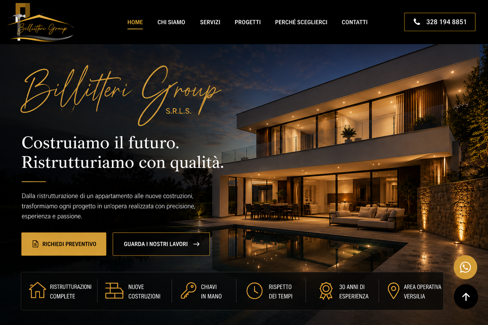

<!DOCTYPE html>
<html lang="it">
<head>
  <meta charset="UTF-8" />
  <meta name="viewport" content="width=device-width, initial-scale=1.0" />
  <title>Billitteri Group S.r.l.s. | Ristrutturazioni e Nuove Costruzioni in Versilia</title>
  <meta name="description" content="Billitteri Group S.r.l.s. - Ristrutturazioni complete, nuove costruzioni, chiavi in mano e opere edili in Versilia." />
  <link rel="stylesheet" href="style.css" />
</head>
<body>
  <main class="homepage" aria-label="Homepage Billitteri Group S.r.l.s.">
    

    
    
    
    

    <section id="progetti" class="placeholder-section">
      <h1>Billitteri Group S.r.l.s.</h1>
      
Pagina iniziale in stile anteprima. Le sezioni successive possono essere aggiunte con galleria lavori, servizi, contatti e Google Maps.

    </section>
  </main>
</body>
</html>

* { box-sizing: border-box; }
html { scroll-behavior: smooth; }
body {
  margin: 0;
  background: #050505;
  font-family: Arial, Helvetica, sans-serif;
  color: #fff;
}
.homepage { position: relative; min-height: 100vh; background: #050505; }
.hero-image {
  width: 100%;
  min-height: 100vh;
  object-fit: cover;
  object-position: center top;
  display: block;
}
.hotspot { position: absolute; display: block; z-index: 5; }
.phone { top: 5.2%; right: 2.4%; width: 15%; height: 6.5%; }
.quote { left: 4.4%; top: 75.4%; width: 17.5%; height: 7.4%; }
.works { left: 23.1%; top: 75.4%; width: 19.5%; height: 7.4%; }
.whatsapp { right: 2.4%; bottom: 10.5%; width: 5.2%; height: 7.5%; border-radius: 50%; }
.placeholder-section {
  padding: 70px 22px;
  max-width: 1100px;
  margin: 0 auto;
  text-align: center;
}
.placeholder-section h1 { color: #d5a032; font-size: 36px; margin: 0 0 12px; }
.placeholder-section p { color: #ddd; font-size: 18px; line-height: 1.6; }
@media (max-width: 900px) {
  .hero-image { min-height: 100vh; width: 100%; height: 100vh; object-fit: cover; object-position: 45% top; }
  .phone { top: 4%; right: 2%; width: 28%; height: 7%; }
  .quote { left: 4%; top: 72%; width: 36%; height: 8%; }
  .works { left: 43%; top: 72%; width: 40%; height: 8%; }
  .whatsapp { right: 4%; bottom: 11%; width: 12%; height: 8%; }
}
